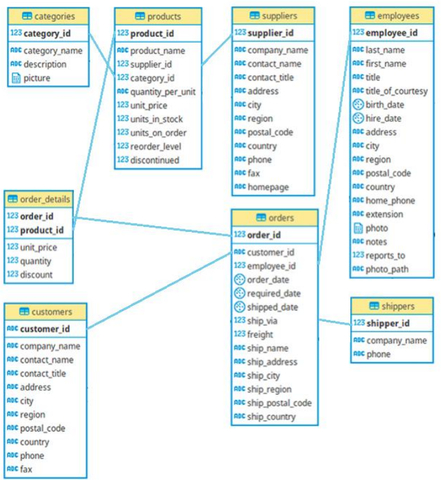
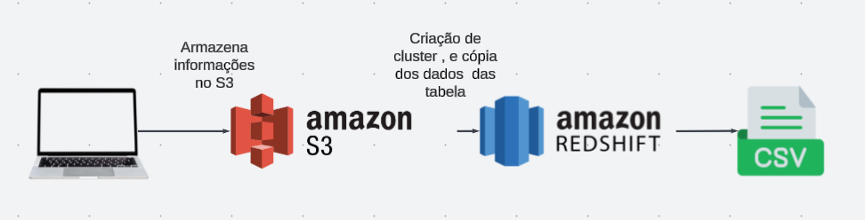

# Datawarehouse-commerce
Técnologias ultilizadas para realizar soluções de requisições e problemas de negócio.

       AWS S3 | AWS Redshift | BD Relacional.

### Objetivo
- O objetivo deste projeto é simular requisições e resolver problemas de negócios de uma empresa fictícia chamada Northwind. A Northwind gerencia pedidos, produtos, clientes, fornecedores, colaboradores, entre outros, e utiliza um banco de dados relacional para suas operações.
  

### Preparação do Ambiente
- Para realizar as atividades propostas, utilizamos a seguinte estrutura:

       1. Criação de um Cluster Redshift
       2. Criação da estrutura do Datawarehouse Northwind
       3. Upload dos arquivos .csv do PC local para um bucket no AWS S3
       4. Cópia dos dados do AWS S3 para o Datawarehouse no Redshift
       5. Resolução das atividades que simulam problemas de negócios e exportação de arquivos .csv
       6. Esquema do Banco de Dados Relacional

### Atividades
1. Relatório de Produtos Vendidos
Gerar um relatório com:

Valores tabelados dos produtos
Valores reais das vendas
Diferença entre os valores tabelados e reais
Quantidade de produtos vendidos por venda

2. Desempenho do Vendedor "Robert King"

Agrupar o valor das vendas dos vendedores no ano de 2022 para analisar o desempenho do vendedor "Robert King".

3. Produtos Mais Caros

Selecionar os 10 produtos com os preços tabelados mais caros.

4. Vendas por Fornecedor
Mostrar a quantidade total de vendas por fornecedor nos anos de 2021 e 2020, e a diferença entre o total de vendas desses anos.

5. Categorias Mais Vendidas
Selecionar as 5 categorias que mais venderam em cada ano.

### Arquivos das Resoluções
Os arquivos estão anexados e separados por atividades , junto de uma foto do esquema que foi seguido. Eles consistem em scripts SQL.
